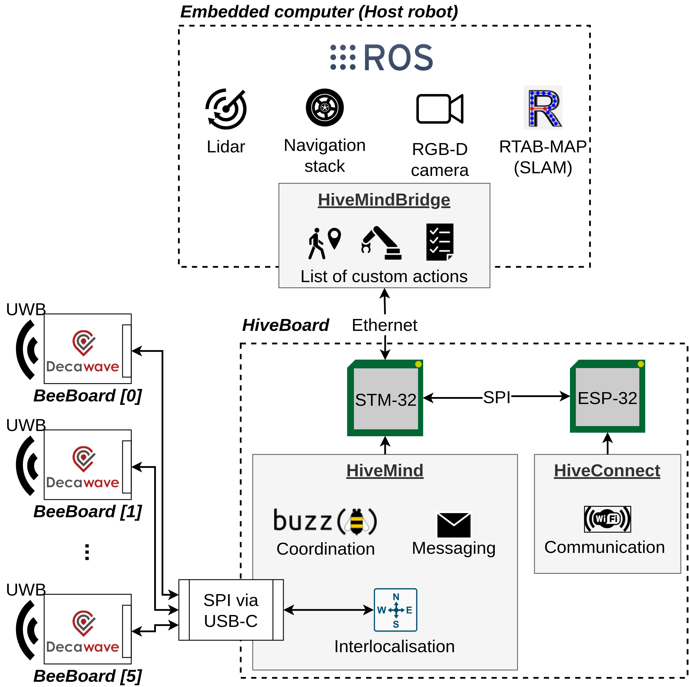

# The SwarmUS Project

A comprehensive, generic and easy-to-use swarm robotics platform.

---

*A heterogenous swarm of three robots (two Pioneer 2DX and one Turtlebot 3 Burger) using the SwarmUS platform*

---

 SwarmUS is a project that helps creating swarms using existing robots. It is a generic development platform that empowers researchers and robotics enthousiasts with the ability to deploy some code easily to their robots. SwarmUS provides the basic infrastructure needed for robots to form a swarm : a decentralized communication stack and a localisation module that help robots locate one another without the need for a common reference.

## How SwarmUS works

<figure markdown>

  {: style="height:600px" }

  <figcaption>A HiveBoard</figcaption>

</figure>

The SwarmUS platform is built around a custom embedded computer called the **HiveBoard**. This board can be attached to any robot using an Ethernet or Micro-USB cable. The HiveBoard provides the three necessary features to form a robot swarm :

1. A **decentralized communication stack** that allows the robots to exchange information and remote procedure calls.
2. An **interlocalisation module** that allows robots to determine their relative position between one another. Each robot can therefore determine the **distance** and **angle** of another robot with respect to its own position.
3. A **coordination language** that allows the user to program some behavioral logic for the swarm. The language used in the SwarmUS platform is [Buzz](https://github.com/buzz-lang/Buzz).

Forming a swarm using existing robots is as simple as plugging a HiveBoard in every robot, writing some coordination code, and interfacing this with each robot's program. The coordination code running on the HiveBoards will then control each individual robot in a coherent manner, in order to achieve some collective goals.

The swarm can then be controlled by an Android application called **HiveAR**. This app allows the user to control the execution of the program, as well as to diagnose the state of each individual robots using a graphical user interface which uses augmented reality (AR). The app is a member of the swarm and uses its own HiveBoard to communicate with the other agents.

*When using SwarmUS, each agent needs to have its own HiveBoard. The swarm can be heterogenous, meaning that the robots can work together even if they don't have all the same capabilities.*

## Architecture

The SwarmUS platform is a decentralized system that comprises a number of different sub-systems. Let's dig in the architecture. This will help understanding how to use SwarmUS.

*A high-level view of the architecture of the SwarmUS platform*

At the center of the system lies the HiveBoard, an embedded computer designed specifically for SwarmUS. It boasts an **STM-32** microcontroller (MCU) that manages the platform firmware, as well as a second MCU (**ESP-32**) that handles the WiFi communication stack. 

The HiveBoard can host up to six auxiliary boards, called **BeeBoards**. These boards are simply antennas and Ultra-wideband (UWB) chips that are used to calculate the position of the other robots.

<figure markdown>

  {: style="height:400px" }

  <figcaption>A BeeBoard</figcaption>

</figure>

The HiveBoard is connected to a robot's embedded computer using an Ethernet cable. On the diagram shown above, the robot is assumed to run ROS, along with a few services. Note however that SwarmUS is completely ROS-agnostic and could be used on any software stack.

[**HiveMind**](sections/reference/HiveMind/hivemind-preface.md) is the firmware that runs on the STM-32 MCU. This firmware manages three key features: the messaging service, the interlocalisation service, and the Buzz VM, which runs the user-code for the swarm's coordination.

[**HiveConnect**](sections/reference/Networking/hiveconnect.md) is the firmware that runs on the ESP-32 MCU. It provides the WiFi communication stack to the messaging service, and allows the configuration of various network topologies, including mesh.

[**HiveMindBridge**](sections/reference/HiveMindBridge/about-hivemindbridge.md) is a C++ library that provides an interface with the HiveBoard. It is meant to be used as a compatibility layer between the robot's existing program and the HiveBoard's services.

<!-- TODO: add some links to the appropriate pages when they are created. -->

## Where to go from here
This documentation provides some guides that will help setting up the different sub-systems that compose the SwarmUS platform. Users that simply want to try ou the platform will want to follow these [User Guides](sections/user-guide/index.md). The user guides provide step-by-step instructions to help users implement a swarm solution using SwarmUS. Complete newcomers will want to start with the [basic examples](sections/user-guide/basic-examples/led-flash-buzz.md), which show how to use the core features of the SwarmUS platform.

More thorough information about the inner workings of the various software components can also be found in the [Reference](sections/reference/index.md) section.

For more information about the hardware developed for the SwarmUS project, visit the [Hardware](sections/hardware/index.md) sections.
